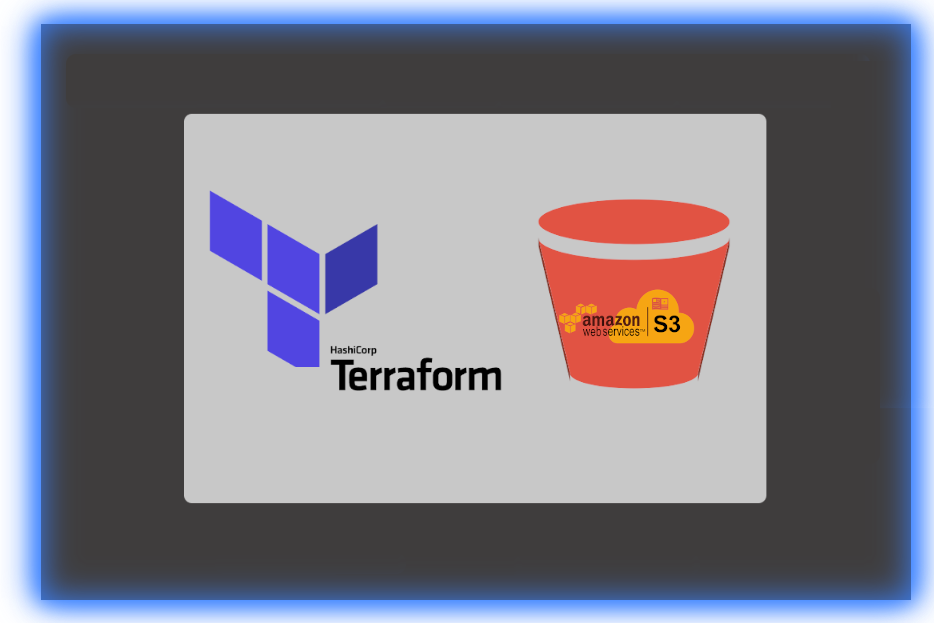

<!-- VSCode Markdown Exclusions-->
<!-- markdownlint-disable MD025 Single Title Headers-->
# CloudMage AWS S3 Terraform Module Documentation

<br>

<!--  -->


<br>

&nbsp;&nbsp;&nbsp;&nbsp;&nbsp;&nbsp;&nbsp;&nbsp;&nbsp;  &nbsp;&nbsp;&nbsp;&nbsp;&nbsp;&nbsp;&nbsp;&nbsp;  &nbsp;&nbsp;&nbsp;  &nbsp;&nbsp;&nbsp; 

<br><br>

# Table of Contents

* [Getting Started](#getting-started)
* [Module Pre-Requisites and Dependencies](#module-pre-requisites-and-dependencies)
* [Module Directory Structure](#module-directory-structure)
* [Module Usage](#module-usage)
* [Terraform Variable Usage](#terraform-variables-usage)
  * [Inline Variable Declaration](#inline-variable-declaration)
  * [TFVar Variable Declaration](#tfvar-variable-declaration)
* [Required Module Variables](#required-variables)
  *  &nbsp; [*bucket*]('')
* [Optional Module Variables](#optional-module-variables)
  *  &nbsp; [*region*]('')
  *  &nbsp; [*bucket_prefix*]('')
  *  &nbsp; [*bucket_suffix*]('')
  *  &nbsp; [*versioning*]('')
  *  &nbsp; [*mfa_delete*]('')
  *  &nbsp; [*encryption*]('')
  *  &nbsp; [*kms_master_key_id*]('')
  *  &nbsp; [*acl*]('')
  *  &nbsp; [*logging_bucket*]('')
  *  &nbsp; [*static_hosting*]('')
  *  &nbsp; [*index_document*]('')
  *  &nbsp; [*error_document*]('')
  *  &nbsp; [*cors_rule*]('')
  *  &nbsp; [*tags*]('')
  *  &nbsp; [*read_access*]('')
  *  &nbsp; [*write_access*]('')
  *  &nbsp; [*public_access*]('')
  *  &nbsp; [*custom_policy*]('')
  *  &nbsp; [*disable_policy_autogen*]('')
* [Module Example Usage](#module-example-usage)
* [Variables and TFVar Reference File Templates](#variables-and-tfvar-reference-file-templates)
* [Module Outputs Reference File Templates](#module-outputs-reference-file-templates)
* [Terraform Requirements](#terraform-requirements)
* [Recommended Terraform Utilities](#recommended-terraform-utilities)
* [Contacts and Contributions](#contacts-and-contributions)

<br><br>

# Getting Started

This AWS S3 bucket module is designed to produce a secure/in-secure AWS S3 bucket depending on the options passed to the module. This module was created with dynamic options that allow the consumer of the module to determine, project by project, what S3 bucket options should be enforced on the requested bucket at the time of the bucket provisioning. It has options that allow the provisioned bucket to be fully insecure, or conversely fully encrypted with an enforcing bucket policy ensuring objects within the bucket are both PUT and stored using either the S3 default encryption key or an AWS KMS (Key Management Service) CMK (Customer Managed Key)

<br><br>

# Module Pre-Requisites and Dependencies

None Defined for an un-encrypted bucket. If the requested bucket requires encryption using a CMK, then the CMK will have to have already been provisioned via the direct TF root project or by using a KMS CMK module.

<br><br>

# Module Directory Structure

```bash
.
├── main.tf
├── variables.tf
├── outputs.tf
├── CHANGELOG.md
├── images
│   ├── tf_s3.png
│   └── tf_s3_tags.png
├── example
│   ├── README.md
│   ├── main.tf
│   ├── variables.tf
│   ├── test_defaults.tf
│   ├── test_encryption.tf
│   ├── test_hosting.tf
│   ├── test_logging.tf
│   ├── test_naming.tf
│   ├── test_policies.tf
│   ├── test_versioning.tf
│   └── s3.auto.tfvars
├── README.md
├── .gitignore
├── locals.tf
├── policies.tf
└── magicdoc.yaml
```

<br><br>

# Module Usage

```terraform
module "example" {
    source = "git@github.com:TheCloudMage/terraform-aws-s3-module?ref=v1.4.1"

    // Required Variables
    bucket = "test-backup-bucket"

    // Optional Variables with module defined default values assigned
    # region            = "us-east-1"
    # bucket_prefix     = []
    # bucket_suffix     = []
    # versioning        = false
    # mfa_delete        = false
    # encryption        = false
    # kms_master_key_id = "AES256"
    # acl               = "private"
    # logging_bucket    = null
    # static_hosting    = false
    # index_document    = "index.html"
    # error_document    = "error.html"
    # read_access       = []
    # write_access      = []
    # public_access     = false
    # custom_policy     = null
    # disable_policy_autogen = null

    # cors_rule = {
    #     allowed_headers = ["*"]
    #     allowed_methods = ["PUT", "POST"]
    #     allowed_origins = ["*"]
    #     expose_headers  = []
    #     max_age_seconds = 3000
    # }

    # tags = {
    #   Provisioned_By = "Terraform"
    #   Module_GitHub_URL = "https://github.com/TheCloudMage/AWS-S3Bucket-Module.git"
    # }
}
```

<br><br>

# Terraform Variable Usage

Module variables that need to either be defined or re-defined with a non-default value can easily be hardcoded inline directly within the module call block or from within the root project that is consuming the module. If using the second approach then the root project must have it's own custom variables defined within the projects `variables.tf` file with set default values or with the values provided from a separate environmental `terraform.tfvar` file. Examples of both approaches can be found below. Note that for the standards used within this documentation, all variables will mostly use the first approach for ease of readability.

<br><br>

>  &nbsp;[__Tip:__](Tip) <br> There is also a third way to provide variable values using Terraform data sources. A data source is a unique type of code block used within a project that either instantiates or collects data that can be referenced throughout the project. A data source, for example,  can be declared to read the terraform state file and gather all of the available information from a previously deployed project stack. Any of the data contained within the data source can then be referenced to set the value of a project or module variable.

<br><br>

## Inline Variable Declaration

```terraform
module "example" {
    source = "git@github.com:TheCloudMage/terraform-aws-s3-module?ref=v1.4.1"

    // Required Variables
    bucket = "test-backup-bucket"
}
```

<br><br>

## TFVar Variable Declaration

<br>

###  &nbsp; [variables.tf](variables.tf)

```terraform
variable "bucket" {
    type        = string
    description = "The base name of the S3 bucket that is being requested. This base name can be made unique by specifing values for either the bucket_prefix, the bucket_suffix, or both module variables."
}
```

<br>

###  &nbsp; [terraform.tfvars](terraform.tfvars)

```terraform
bucket = "test-backup-bucket"
```

<br>

###  &nbsp; [main.tf](main.tf)

```terraform
module "example" {
    source = "git@github.com:TheCloudMage/terraform-aws-s3-module?ref=v1.4.1"

    // Required Variables
    bucket = var.bucket
}
```

<br><br>

# Required Variables

The following required module variables do not contain default values and must be set by the consumer of the module to use the module successfully.

<br>

##  &nbsp; [bucket](tfvar.name)

<br>

The base name of the S3 bucket that is being requested. This base name can be made unique by specifing values for either the bucket_prefix, the bucket_suffix, or both module variables.

<br><br>

###  &nbsp; Declaration of [bucket](bucket) within the modules variables.tf file

```terraform
variable "bucket" {
    type        = string
    description = "The base name of the S3 bucket that is being requested. This base name can be made unique by specifing values for either the bucket_prefix, the bucket_suffix, or both module variables."
}
```

<br><br>

###  &nbsp; Setting the [bucket](bucket) module variable within a projects root main.tf file

```terraform
module "example" {
    source = "git@github.com:TheCloudMage/terraform-aws-s3-module?ref=v1.4.1"

    // Declaring the "bucket" variable
    bucket = "test-backup-bucket"

    // Other Required Variables
}
```

<br><br><br>

# Optional Module Variables

The following optional module variables are not required because they already have default values assigned when the variables where defined within the modules `variables.tf` file. If the default values do not need to be changed by the root project consuming the module, then they do not even need to be included in the root project. If any of the variables do need to be changed, then they can be added to the root project in the same way that the required variables were defined and utilized. Optional variables also may alter how the module provisions resources in the cases of encryption or IAM policy generation. A variable could flag an encryption requirement when provisioning an S3 bucket or Dynamo table by providing a KMS CMK, for example. Another use case may be the passage of ARN values to allow users or roles access to services or resources, whereas by default permissions would be more restrictive or only assigned to the account root or a single IAM role. A detailed explanation of each of these optional variables can be found below:

<br>

##  &nbsp; [region](tfvar.name)

<br>

This variable can contain a specific AWS region where the requested S3 bucket should be provisioned. If no region is specified, the bucket will be created in the region, from which the module is running against via the root project. The default string value of the region variable is set to **empty**, this allows the module to replace the empty string with the current AWS region obtained by the Terraform data source provider `aws_region`.

<br><br>

###  &nbsp; Declaration of [region](region) within the modules variables.tf file

```terraform
variable "region" {
    type        = string
    description = "The AWS region where the S3 bucket will be provisioned."
    default     = "us-east-1"
}
```

<br><br>

###  &nbsp; Setting the [region](region) module variable within a projects root main.tf file

```terraform
module "example" {
    source = "git@github.com:TheCloudMage/terraform-aws-s3-module?ref=v1.4.1"

    // Required Variables
    bucket = "test-backup-bucket"


    // Optional Variables with module defined default values assigned
    region = "Example Value"
}
```

<br><br><br>

##  &nbsp; [bucket_prefix](tfvar.name)

<br>

A prefix list that will be added to the start of the bucket name. For example if bucket_prefix=['test'], then the bucket will be named 'test-$${bucket}'. This module will also look for the keywords 'region_prefix' and 'account_prefix' and will substitute the current region, or account_id within the module as in the example: bucket_prefix=['test', 'region_prefix', 'account_prefix'], resulting in the bucket 'test-us-east-1-1234567890101-$${bucket}'. If left blank no prefix will be added. This list variable should contain the values of any prefix that you want to prepend to the beginning of the requested S3 bucket. Specifying any sequence of values to the list will change the calculated bucket name by adding each of the specified values with a hyphen to the begging of the supplied bucket.

<br>

__Note: Special bucket_prefix Keywords:__

* `region_prefix`: Adding this keyword to the bucket prefix list will result in the resolution of the desired or current execution region, and will place that region into the bucket name string.

* `account_prefix`: Adding this keyword to the bucket prefix list will result in the resolution of the current execution region, and will place that account Id into the bucket name string.

<br><br>

###  &nbsp; Declaration of [bucket_prefix](bucket_prefix) within the modules variables.tf file

```terraform
variable "bucket_prefix" {
    type        = list
    description = "A prefix list that will be added to the start of the bucket name. For example if bucket_prefix=['test'], then the bucket will be named 'test-$${bucket}'. This module will also look for the keywords 'region_prefix' and 'account_prefix' and will substitute the current region, or account_id within the module as in the example: bucket_prefix=['test', 'region_prefix', 'account_prefix'], resulting in the bucket 'test-us-east-1-1234567890101-$${bucket}'. If left blank no prefix will be added."
    default     = []
}
```

<br><br>

###  &nbsp; Setting the [bucket_prefix](bucket_prefix) module variable within a projects root main.tf file

```terraform
module "example" {
    source = "git@github.com:TheCloudMage/terraform-aws-s3-module?ref=v1.4.1"

    // Required Variables
    bucket = "test-backup-bucket"

    // Optional Variables with module defined default values assigned
    bucket_prefix = ["account_prefix"]
}
```

<br><br><br>

##  &nbsp; [bucket_suffix](tfvar.name)

<br>

A suffix list that will be added to the end of the bucket name. For example if bucket_suffix=['test'], then the bucket will be named '$${bucket}-test'. This module will also look for the keywords 'region_suffix' and 'account_suffix' and will substitute the current region, or account_id within the module as in the example: bucket_suffix=['region_suffix', 'account_suffix', 'test'], resulting in the bucket name '$${bucket}-us-east-1-1234567890101-test'. If left blank no suffix will be added. This list variable should contain the values of any suffix that you want to append to the end of the requested S3 bucket. Specifying any sequence of values to the list will change the calculated bucket name by adding each of the specified values with a hyphen to the end of the supplied bucket.

<br>

__Note: Special bucket_suffix Keywords:__

* `region_suffix`: Adding this keyword to the bucket prefix list will result in the resolution of the desired or current execution region, and will place that region into the bucket name string.

* `account_suffix`: Adding this keyword to the bucket prefix list will result in the resolution of the current execution region, and will place that account Id into the bucket name string.

<br><br>

>  &nbsp; [__Note:__](Note) <br> You can use any combination of prefix and suffix values together to create a unique account-specific bucket path.

<br><br>

###  &nbsp; Declaration of [bucket_suffix](bucket_suffix) within the modules variables.tf file

```terraform
variable "bucket_suffix" {
    type        = list
    description = "A suffix list that will be added to the end of the bucket name. For example if bucket_suffix=['test'], then the bucket will be named '$${bucket}-test'. This module will also look for the keywords 'region_suffix' and 'account_suffix' and will substitute the current region, or account_id within the module as in the example: bucket_suffix=['region_suffix', 'account_suffix', 'test'], resulting in the bucket name '$${bucket}-us-east-1-1234567890101-test'. If left blank no suffix will be added."
    default     = []
}
```

<br><br>

###  &nbsp; Setting the [bucket_suffix](bucket_suffix) module variable within a projects root main.tf file

```terraform
module "example" {
    source = "git@github.com:TheCloudMage/terraform-aws-s3-module?ref=v1.4.1"

    // Required Variables
    bucket = "test-backup-bucket"

    // Optional Variables with module defined default values assigned
    bucket_suffix     = ["region_suffix"]
}
```

<br><br><br>

##  &nbsp; [versioning](tfvar.name)

<br>

This variable will turn flag versioning on or off on the bucket. It is important to note that once versioning is turned on within S3 for a given bucket, it can be later disabled, but never removed.

<br><br>

###  &nbsp; Declaration of [versioning](versioning) within the modules variables.tf file

```terraform
variable "versioning" {
    type        = bool
    description = "Flag to enable bucket object versioning."
    default     = false
}
```

<br><br>

###  &nbsp; Setting the [versioning](versioning) module variable within a projects root main.tf file

```terraform
module "example" {
    source = "git@github.com:TheCloudMage/terraform-aws-s3-module?ref=v1.4.1"

    // Required Variables
    bucket = "test-backup-bucket"

    // Optional Variables with module defined default values assigned
    versioning = true
}
```

<br><br><br>

##  &nbsp; [mfa_delete](tfvar.name)

<br>

This variable will flag the requirement for MFA authentication before removing an object version or suspending versioning within a bucket that has versioning enabled.

<br><br>

###  &nbsp; Declaration of [mfa_delete](mfa_delete) within the modules variables.tf file

```terraform
variable "mfa_delete" {
    type        = bool
    description = "Flag to enable the requirement of MFA in order to delete a bucket, object, or disable object versioning."
    default     = false
}
```

<br><br>

###  &nbsp; Setting the [mfa_delete](mfa_delete) module variable within a projects root main.tf file

```terraform
module "example" {
    source = "git@github.com:TheCloudMage/terraform-aws-s3-module?ref=v1.4.1"

    // Required Variables
    bucket = "test-backup-bucket"

    // Optional Variables with module defined default values assigned
    mfa_delete = false
}
```

<br><br><br>

##  &nbsp; [encryption](tfvar.name)

<br>

This variable is a flag if encryption should be configured on the requested bucket. Setting this value to true will automatically turn on encryption on the bucket at the time of provisioning using the default S3/AES256 AWS managed KMS Key.

<br><br>

>  &nbsp; [__Note:__](Note) <br> Activating this variable will automatically create a bucket policy that will be attached to the bucket forcing encryption in transit for all upload and PUT requests to the bucket.

<br><br>

###  &nbsp; Declaration of [encryption](encryption) within the modules variables.tf file

```terraform
variable "encryption" {
    type        = bool
    description = "Flag to enable bucket object encryption."
    default     = false
}
```

<br><br>

###  &nbsp; Setting the [encryption](encryption) module variable within a projects root main.tf file

Setting the `encryption` option to true will automatically add the following bucket policy to the bucket at the time of provisioning unless disable_policy_autogen is set:

<br><br>

### Generated Bucket Policy

```yaml
Statement:
  - Sid: "DenyNonSecureTransport"
    Effect: Deny
    Principal:
    AWS:
        - "*"
    Action:
        - "s3:*"
    Resources:
        - "arn:aws:s3:::my_bucket"
        - "arn:aws:s3:::my_bucket/*"
    Condition: {
        "Bool": {
        "aws:SecureTransport: "false"
        }
    }
```

<br><br>

```terraform
module "example" {
    source = "git@github.com:TheCloudMage/terraform-aws-s3-module?ref=v1.4.1"

    // Required Variables
    bucket = "test-backup-bucket"

    // Optional Variables with module defined default values assigned
    encryption = true
}
```

<br><br><br>

##  &nbsp; [kms_master_key_id](tfvar.name)

<br>

This variable is used to define an existing KMS CMK that is preferred to encrypt objects into the bucket. Using a CMK instead of the default AWS Managed KMS key allows more granular control over the permissions of the encryption key used to encrypt the objects within the bucket.

<br><br>

>  &nbsp; [__Note:__](Note) <br> When supplying a KMS CMK Key ARN, the bucket encryption type will automatically switch from **AES256** to **aws:kms**. Encryption will work the same way, only using the provided key instead of the Amazon managed default S3 key. The bucket policy shown above will also still be applied.

<br><br>

###  &nbsp; Declaration of [kms_master_key_id](kms_master_key_id) within the modules variables.tf file

```terraform
variable "kms_master_key_id" {
    type        = string
    description = "The key that will be used to encrypt objects within the new bucket. If the default value of AES256 is unchanged, S3 will encrypt objects with the default KMS key. If a KMS CMK ARN is provided, then S3 will encrypt objects with the specified KMS key instead."
    default     = "AES256"
}
```

<br><br>

###  &nbsp; Setting the [kms_master_key_id](kms_master_key_id) module variable within a projects root main.tf file

```terraform
module "example" {
    source = "git@github.com:TheCloudMage/terraform-aws-s3-module?ref=v1.4.1"

    // Required Variables
    bucket = "test-backup-bucket"

    // Optional Variables with module defined default values assigned
    kms_master_key_id = "arn:aws:kms:us-east-1:123456789101:key/127ab3c4-de5f-6e7d-898c-7ba6b5432abc"
}
```

<br><br><br>

##  &nbsp; [acl](tfvar.name)

<br>

This variable is used to pass the desired permissions of the bucket at the time of provisioning the bucket. The default value is set to private but can be changed by providing a valid permission keyword as the value for the `acl` variable. Valid values for this variable are as follows:

* __private__ - Owner gets FULL_CONTROL. No one else has access rights (default).
* __public-read__ - Owner gets FULL_CONTROL. The AllUsers group gets READ access.
* __public-read-write__ - Owner gets FULL_CONTROL. The AllUsers group gets READ and WRITE access. Not generally recommended.
* __aws-exec-read__ - Owner gets FULL_CONTROL. EC2 gets READ access to GET an AMI bundle from Amazon S3.
* __authenticated-read__ - Owner gets FULL_CONTROL. The AuthenticatedUsers group gets READ access.
* __bucket-owner-read__ - Object owner gets FULL_CONTROL. Bucket owner gets READ access.
* __bucket-owner-full-control__ - Both the object owner and the bucket owner get FULL_CONTROL over the object.
* __log-delivery-write__ - The LogDelivery group gets WRITE and READ_ACP permissions on the bucket.

<br><br>

###  &nbsp; Declaration of [acl](acl) within the modules variables.tf file

```terraform
variable "acl" {
    type        = string
    description = "The Access Control List that will be placed on the bucket. Acceptable Values are: 'private', 'public-read', 'public-read-write', 'aws-exec-read', 'authenticated-read', 'bucket-owner-read', 'bucket-owner-full-control', or 'log-delivery-write'"
    default     = "private"
}
```

<br><br>

###  &nbsp; Setting the [acl](acl) module variable within a projects root main.tf file

```terraform
module "example" {
    source = "git@github.com:TheCloudMage/terraform-aws-s3-module?ref=v1.4.1"

    // Required Variables
    bucket = "test-backup-bucket"

    // Optional Variables with module defined default values assigned
    acl = "public-read"
}
```

<br><br><br>

##  &nbsp; [logging_bucket](tfvar.name)

<br>

The base name of the S3 bucket that will be used as the log bucket for the provisioned s3 buckets access logs. If activated, logging will be configured on the S3 bucket being provisioned, and will automatically write logs to the configured logging bucket, in a folder named after this provisioned bucket.

<br><br>

###  &nbsp; Declaration of [logging_bucket](logging_bucket) within the modules variables.tf file

```terraform
variable "logging_bucket" {
    type        = string
    description = "The base name of the S3 bucket that will be used as the log bucket for the provisioned s3 buckets access logs"
    default     = null
}
```

<br><br>

###  &nbsp; Setting the [logging_bucket](logging_bucket) module variable within a projects root main.tf file

```terraform
module "example" {
    source = "git@github.com:TheCloudMage/terraform-aws-s3-module?ref=v1.4.1"

    // Required Variables
    bucket = "test-backup-bucket"

    // Optional Variables with module defined default values assigned
    logging_bucket = "test-logging-bucket"
}
```

<br><br><br>

##  &nbsp; [static_hosting](tfvar.name)

<br>

Flag that can be set to turn on static hosting within a bucket. If this flag is set to true, then the bucket will have static hosting enabled on instantiation.

<br><br>

###  &nbsp; Declaration of [static_hosting](static_hosting) within the modules variables.tf file

```terraform
variable "static_hosting" {
    type        = bool
    description = "Flag that can be set to turn on static hosting within a bucket."
    default     = false
}
```

<br><br>

###  &nbsp; Setting the [static_hosting](static_hosting) module variable within a projects root main.tf file

```terraform
module "example" {
    source = "git@github.com:TheCloudMage/terraform-aws-s3-module?ref=v1.4.1"

    // Required Variables
    bucket = "test-backup-bucket"

    // Optional Variables with module defined default values assigned
    static_hosting = true
}
```

<br><br><br>

##  &nbsp; [index_document](tfvar.name)

<br>

Value of the index file served by the static hosting bucket server if static hosting is enabled. This variable should hold the name of whatever entry point file the web server should be serving for its index.

<br><br>

###  &nbsp; Declaration of [index_document](index_document) within the modules variables.tf file

```terraform
variable "index_document" {
    type        = string
    description = "Value of the index file served by the static hosting bucket server if static hosting is enabled."
    default     = "index.html"
}
```

<br><br>

###  &nbsp; Setting the [index_document](index_document) module variable within a projects root main.tf file

```terraform
module "example" {
    source = "git@github.com:TheCloudMage/terraform-aws-s3-module?ref=v1.4.1"

    // Required Variables
    bucket = "test-backup-bucket"

    // Optional Variables with module defined default values assigned
    index_document = "index.htm"
}
```

<br><br><br>

##  &nbsp; [error_document](tfvar.name)

<br>

Value of the error file served by the static hosting bucket server if static hosting is enabled. This variable should hold the name of whatever entry point error file the web server should be serving in the event that an error is encountered.

<br><br>

###  &nbsp; Declaration of [error_document](error_document) within the modules variables.tf file

```terraform
variable "error_document" {
    type        = string
    description = "Value of the error file served by the static hosting bucket server if static hosting is enabled."
    default     = "error.html"
}
```

<br><br>

###  &nbsp; Setting the [error_document](error_document) module variable within a projects root main.tf file

```terraform
module "example" {
    source = "git@github.com:TheCloudMage/terraform-aws-s3-module?ref=v1.4.1"

    // Required Variables
    bucket = "test-backup-bucket"

    // Optional Variables with module defined default values assigned
    error_document = "error.htm"
}
```

<br><br><br>

##  &nbsp; [cors_rule](tfvar.name)

<br>

Cross Origin Resource Sharing ruleset to apply to the bucket. This variable holds a map or JSON structured CORs config. The object should have the following fields:

<br>

```json
{
    "allowed_headers": ["*"],
    "allowed_methods": ["PUT", "POST"],
    "allowed_origins": ["*"],
    "expose_headers": [],
    "max_age_seconds": 3000
}
```

<br><br>

###  &nbsp; Declaration of [cors_rule](cors_rule) within the modules variables.tf file

```terraform
variable "cors_rule" {
    type        = map
    description = "Cross Origin Resource Sharing ruleset to apply to the bucket"
    default     = {
        allowed_headers = ["*"]
        allowed_methods = ["PUT", "POST"]
        allowed_origins = ["*"]
        expose_headers  = []
        max_age_seconds = 3000
    }
}
```

<br><br>

###  &nbsp; Setting the [cors_rule](cors_rule) module variable within a projects root main.tf file

```terraform
module "example" {
    source = "git@github.com:TheCloudMage/terraform-aws-s3-module?ref=v1.4.1"

    // Required Variables
    bucket = "test-backup-bucket"

    // Optional Variables with module defined default values assigned
    cors_rule = {
        allowed_headers = ["*"]
        allowed_methods = ["GET", "PUT", "POST"]
        allowed_origins = ["*"]
        expose_headers  = ["Test"]
        max_age_seconds = 3000
    }
}
```

<br><br><br>

##  &nbsp; [tags](tfvar.name)

<br>

This variable should contain a map of tags that will be assigned to the S3 bucket upon creation. Any tags contained within the `tags` map variable will be passed to the module and automatically merged with a few tags that are also automatically created when the module is executed. The automatically generated tags are as follows:

* __Name__ - This tag is assigned the value from the `tags` required variable that is passed during module execution
* __Created_By__ - This tag is assigned the value of the aws user that was used to execute the Terraform module to create the S3 bucket. It uses the Terraform `aws_caller_identity {}` data source provider to obtain the User_Id value. This tag will be ignored for any future executions of the module, ensuring that its value will not be changed after it's initial creation.
* __Creator_ARN__ - This tag is assigned the ARN value of the aws user that was used to execute the Terraform module to create the S3 Bucket. It uses the Terraform `aws_caller_identity {}` data source provider to obtain the User_ARN value. This tag will be ignored for any future executions of the module, ensuring that its value will not be changed after it's initial creation.
* __Creation_Date__ - This tag is assigned a value that is obtained by the Terraform `timestamp()` function. This tag will be ignored for any future executions of the module, ensuring that its value will not be changed after it's initial creation.
* __Updated_On__ - This tag is assigned a value that is obtained by the Terraform `timestamp()` function. This tag will be updated on each future execution of the module to ensure that it's value displays the last `terraform apply` date.
* __Encrypted__ - This tag is assigned the value from the `encryption` variable. If the consumer of the module did not flag the encryption option, then by default the value of the `encryption` variable is set to `false`.
* __CMK_ARN__ - This tag is assigned the value from the `kms_master_key_id` variable if provisioning an encrypted bucket. If the bucket is not encrypted this tag will be excluded. If encryption was enabled and a kms cmk was not passed, then the tag will indicate that encryption is configured using the default aws/s3 managed key.

<br><br>

###  &nbsp; Declaration of [tags](tags) within the modules variables.tf file

```terraform
variable "tags" {
    type        = map
    description = "Specify any tags that should be added to the S3 bucket being provisioned."
    default     = {
        Provisioned_By = "Terraform"
        Module_GitHub_URL = "https://github.com/TheCloudMage/AWS-S3Bucket-Module.git"
    }
}
```

<br><br>

###  &nbsp; Setting the [tags](tags) module variable within a projects root main.tf file

```terraform
module "example" {
    source = "git@github.com:TheCloudMage/terraform-aws-s3-module?ref=v1.4.1"

    // Required Variables
    bucket = "test-backup-bucket"

    // Optional Variables with module defined default values assigned
    tags = {
        Provisioned_By = "Terraform"
        Module_GitHub_URL = "https://github.com/TheCloudMage/AWS-S3Bucket-Module.git"
    }
}
```

<br><br>


<br><br><br>

##  &nbsp; [read_access](tfvar.name)

<br>

This variable is used to define a list of users/roles that will be added to the S3 bucket policy on the provisioned bucket for cross account access. If the variable is not defined, then no additional bucket policy statement will be applied to the bucket. If a list of roles/users is defined, then the provided list will instead be used to construct a bucket policy statement allowing those principals `READ ONLY` access to the provisioned S3 bucket. Typically this variable will only be used if the bucket requires access from users/roles in another account that require access to the bucket. The provisioned bucket policy statement enabled by this variable will be appended to the forced encryption in transit policy created by enabling encryption on the bucket. If encryption was not enabled on the bucket, then the policy will only contain this policy statement alone.

<br>

The following permissions will be applied to the read_access bucket policy statement for the specified users/roles provided:

* s3:HeadBucket
* s3:ListBucket*
* s3:ListAllMyBuckets
* s3:ListBucketVersions
* s3:ListBucketMultipartUploads
* s3:ListMultipartUploadParts
* s3:GetBucketLocation
* s3:GetBucketVersioning
* s3:GetEncryptionConfiguration
* s3:GetObjectTagging
* s3:GetObjectVersion
* s3:GetObject

<br><br>

>  &nbsp; [__Note:__](Note) <br> Activating this variable will automatically create a bucket policy that will be attached to the bucket allowing cross account access to the users/roles specified by their ARNs within the list variable.

<br><br>

###  &nbsp; Declaration of [read_access](read_access) within the modules variables.tf file

```terraform
variable "read_access" {
    type        = list("string")
    description = "List of users/roles that will be granted permissions to LIST, DESCRIBE, and GET objects from the provisioned S3 bucket."
    default     = []
}
```

<br><br>

###  &nbsp; Setting the [read_access](read_access) module variable within a projects root main.tf file

```terraform
module "example" {
    source = "git@github.com:TheCloudMage/terraform-aws-s3-module?ref=v1.4.1"

    // Required Variables
    bucket = "test-backup-bucket"

    // Optional Variables with module defined default values assigned
    read_access = ["arn:aws:iam::123456789101:role/AWS-S3RO-Role"]
}
```

<br><br><br>

##  &nbsp; [write_access](tfvar.name)

<br>

This variable is used to define a list of users/roles that will be added to the S3 bucket policy on the provisioned bucket for cross account access. If the variable is not defined, then no additional bucket policy statement will be applied to the bucket. If a list of roles/users is defined, then the provided list will instead be used to construct a bucket policy statement allowing those principals `WRITE` access to the provisioned S3 bucket. Typically this variable will only be used if the bucket requires access from users/roles in another account that require access to the bucket. The provisioned bucket policy statement enabled by this variable will be appended to the forced encryption in transit policy created by enabling encryption on the bucket. If encryption was not enabled on the bucket, then the policy will only contain this policy statement alone.

<br>

The following permissions will be applied to the write_access bucket policy statement for the specified users/roles provided:

* s3:AbortMultipartUpload
* s3:PutObject
* s3:PutObjectRetention
* s3:DeleteObject
* s3:DeleteObjectVersion
* s3:RestoreObject

<br><br>

>  &nbsp; [__Note:__](Note) <br> Activating this variable will automatically create a bucket policy that will be attached to the bucket allowing cross account access to the users/roles specified by their ARNs within the list variable.

<br><br>

###  &nbsp; Declaration of [write_access](write_access) within the modules variables.tf file

```terraform
variable "write_access" {
    type        = list("string")
    description = "List of users/roles that will be granted permissions to PUT, and DELETE objects to/from the provisioned S3 bucket."
    default     = []
}
```

<br><br>

###  &nbsp; Setting the [write_access](write_access) module variable within a projects root main.tf file

```terraform
module "example" {
    source = "git@github.com:TheCloudMage/terraform-aws-s3-module?ref=v1.4.1"

    // Required Variables
    bucket = "test-backup-bucket"

    // Optional Variables with module defined default values assigned
    write_access = ["arn:aws:iam::123456789101:role/AWS-S3W-Role"]
}
```

<br><br><br>

##  &nbsp; [public_access](tfvar.name)

<br>

This variable is used to specify if the bucket will allow public read access. If this variable is set to `true`, then two things will occur. The first will be the addition of a bucket policy statement will allow s3:GetObject for any principal (*). The second change will be to the default secure transport policy with one added condition. If `public_read = true` and `static_hosting = true` then instead of the policy denying all traffic over non secure transports, the bucket will allow s3:GetObject to occur for non secure transport. This will allow the bucket to serve objects over http if CloudFront or another mechanism isn't being used to enforce https delivery of your web content. This policy change will only occur with the condition that the bucket is being has static hosting enabled, and public read is set to true. Only one of these conditions will not allow the enforcement of the policy change. Setting this variable to `true` is only recommended if the bucket will be used to host a publicly available web site hosted by S3.

<br>

The following policy statement will be applied to the public_access bucket policy:

```json
{
    "Sid": "PublicAccess",
    "Effect": "Allow",
    "Principal": "*",
    "Action": [
      "s3:GetObject"
    ],
    "Resource": [
      "arn:aws:s3:::${bucket}/*"
    ]
}
```

<br><br>

Additionally if `public_read = true` and `static_hosting = true` then the secure transport policy will be changed to:

```json
{
    "Sid": "DenyNonSecureTransportExceptGetObject",
    "Effect": "Deny",
    "Principal":  "*",
    "NotAction": "s3:GetObject",
    "Resource": [
        "arn:aws:s3:::cloudmage.io/*",
        "arn:aws:s3:::cloudmage.io"
    ],
    "Condition": {
        "Bool": {
            "aws:SecureTransport": "false"
        }
    }
}
```

<br><br>

>  &nbsp; [__Note:__](Note) <br> Activating this variable will automatically create a bucket policy that will be attached to the bucket allowing public read access to objects in the source s3 bucket.

<br><br>

###  &nbsp; Declaration of [public_access](public_access) within the modules variables.tf file

```terraform
variable "public_access" {
    type        = bool
    description = "Specify if the bucket will be publicly readable (Recommended for static web hosting for public sites)."
    default     = false
}
```

<br><br>

###  &nbsp; Setting the [public_access](public_access) module variable within a projects root main.tf file

```terraform
module "example" {
    source = "git@github.com:TheCloudMage/terraform-aws-s3-module?ref=v1.4.1"

    // Required Variables
    bucket = "test-backup-bucket"

    // Optional Variables with module defined default values assigned
    public_access = true
}
```

<br><br><br>

##  &nbsp; [custom_policy](tfvar.name)

<br>

Flag to only use the custom provided policy in the form of a terraform data iam_policy_document resource, without appending to the default policy. Use %BUCKET% for bucket name. The policy should be constructed as a terraform data source, and referenced accordingly. Using the example below, the resulting bucket policy will be a collection of the encryption in transit policy statement, any read_access policy statement constructed depending on if values were supplied to the variable or not, any write_access policy statement again constructed depending on if values were supplied to the variable or not and the custom policy referenced in the data object:

<br>

```terraform
data "aws_iam_policy_document" "dev_qa_bucket_policy" {
    statement {
        actions = [
            "s3:GetObject",
            "s3:GetObjectVersion",
            "s3:GetBucketObjectLockConfiguration",
            "s3:PutObject",
            "s3:DeleteObject",
            "s3:DeleteObjectVersion",
            "s3:AbortMultipartUpload"
        ]

        principals {
            type = "AWS"
            identifiers = ["*"]
        }

        resources = [
            "%BUCKET%",
            "%BUCKET%/*",
        ]

        condition {
            test     = "StringLike"
            variable = "aws:userId"
            values   = [
                "ZABYCD1EFG2H34ISNPDOG:user1@mydomain.tld",
                "ZABYCD1EFG2H34ISNPDOG:user2@mydomain.tld",
                "ZABYCD1EFG2H34ISNPDOG:user3@mydomain.tld",
                "ZABYCD1EFG2H34ISNPDOG:user4@mydomain.tld",
                "ZABYCD1EFG2H34ISNPDOG:user5@mydomain.tld"
            ]
        }
    }
}
```

<br>

```terraform
module "bucket" {
    source  = "../"

    bucket        = var.bucket
    region        = local.region
    custom_policy = data.aws_iam_policy_document.dev_qa_bucket_policy.json
}
```

<br><br>

###  &nbsp; Declaration of [policy](policy) within the modules variables.tf file

```terraform
variable "custom_policy" {
    type        = string
    description = "A bucket policy in the form of a data iam_policy_document. Use %BUCKET% for bucket name. This policy will be added to the read_access/write_access policy."
    default     = null
}
```

<br><br>

###  &nbsp; Setting the [custom_policy](custom_policy) module variable within a projects root main.tf file

```terraform
module "example" {
    source = "git@github.com:TheCloudMage/terraform-aws-s3-module?ref=v1.4.1"

    // Required Variables
    bucket = "test-backup-bucket"

    // Optional Variables with module defined default values assigned
    custom_policy = data.aws_iam_policy_document.dev_qa_bucket_policy.json
}
```

<br><br><br>

##  &nbsp; [disable_policy_autogen](tfvar.name)

<br>

Setting this optional flag to true will disable any automatically generated policies and will ONLY use the custom_policy. The read_access and write_access vars will be ignored. Use %BUCKET% for bucket name. The policy should be constructed as a terraform data source, and referenced accordingly. Using the example below, the resulting bucket policy will be a collection of the encryption in transit policy statement, any read_access policy statement constructed depending on if values were supplied to the variable or not, any write_access policy statement again constructed depending on if values were supplied to the variable or not and the custom policy referenced in the data object:

<br>

```terraform
data "aws_iam_policy_document" "dev_qa_bucket_policy" {
    statement {
        actions = [
            "s3:DeleteObject",
            "s3:DeleteObjectVersion",
            "s3:AbortMultipartUpload"
        ]

        principals {
            type = "AWS"
            identifiers = ["arn:aws:iam::123456789101:role/AWS-S3W-Role"]
        }

        resources = [
            "%BUCKET%",
            "%BUCKET%/*",
        ]
    }
}
```

<br>

```terraform
module "bucket" {
    source  = "../"

    bucket            = var.bucket
    region            = local.region
    custom_policy     = data.aws_iam_policy_document.dev_qa_bucket_policy.json
    disable_policy_autogen = true
}
```

<br><br>

###  &nbsp; Declaration of [disable_policy_autogen](disable_policy_autogen) within the modules variables.tf file

```terraform
variable "disable_policy_autogen" {
    type        = string
    description = "Setting this optional flag to true will disable any automatically generated policies and will ONLY use the custom_policy. The read_access and write_access vars will be ignored."
    default     = null
}
```

<br><br>

###  &nbsp; Setting the [disable_policy_autogen](disable_policy_autogen) module variable within a projects root main.tf file

```terraform
module "example" {
    source = "git@github.com:TheCloudMage/terraform-aws-s3-module?ref=v1.4.1"

    // Required Variables
    bucket = "test-backup-bucket"

    // Optional Variables with module defined default values assigned
    custom_policy     = data.aws_iam_policy_document.dev_qa_bucket_policy.json
    disable_policy_autogen = true
}
```

<br><br><br>

# Module Example Usage

An example of how to use this module can be found within the `example` directory of this repository.

<br><br>

# Variables and TFVar Reference File Templates

The following code blocks can be used or appended to an existing `variables.tf` file or `terraform.tfvars` file respectively within the project root consuming this module. Optional Variables are commented out and have their values set to the default values defined in the module's variables.tf/terraform.tfvars respective file. If the values of any optional variables do not need to be changed, then they do not need to be redefined or included in the project root. If they do need to be changed, then add them to the root project and change the values according to the project requirements.

<br><br>

##  &nbsp; Module [variables.tf](variables.tf) Reference File

```terraform
###########################################################################
# Required AWS-S3Bucket-Module Module Vars:
#-------------------------------------------------------------------------#
# The following variables require consumer defined values to be provided. #
###########################################################################
variable "bucket" {
    type        = string
    description = "The base name of the S3 bucket that is being requested. This base name can be made unique by specifing values for either the bucket_prefix, the bucket_suffix, or both module variables."
}


###########################################################################
# Optional AWS-S3Bucket-Module Module Vars:
#-------------------------------------------------------------------------#
# The following variables have default values already set by the module.  #
# They will not need to be included in a project root module variables.tf #
# file unless a non-default value needs be assigned to the variable.      #
###########################################################################
variable "region" {
    type        = string
    description = "The AWS region where the S3 bucket will be provisioned."
    default     = "us-east-1"
}
variable "bucket_prefix" {
    type        = list
    description = "A prefix list that will be added to the start of the bucket name. For example if bucket_prefix=['test'], then the bucket will be named 'test-$${bucket}'. This module will also look for the keywords 'region_prefix' and 'account_prefix' and will substitute the current region, or account_id within the module as in the example: bucket_prefix=['test', 'region_prefix', 'account_prefix'], resulting in the bucket 'test-us-east-1-1234567890101-$${bucket}'. If left blank no prefix will be added."
    default     = []
}
variable "bucket_suffix" {
    type        = list
    description = "A suffix list that will be added to the end of the bucket name. For example if bucket_suffix=['test'], then the bucket will be named '$${bucket}-test'. This module will also look for the keywords 'region_suffix' and 'account_suffix' and will substitute the current region, or account_id within the module as in the example: bucket_suffix=['region_suffix', 'account_suffix', 'test'], resulting in the bucket name '$${bucket}-us-east-1-1234567890101-test'. If left blank no suffix will be added."
    default     = []
}
variable "versioning" {
    type        = bool
    description = "Flag to enable bucket object versioning."
    default     = false
}
variable "mfa_delete" {
    type        = bool
    description = "Flag to enable the requirement of MFA in order to delete a bucket, object, or disable object versioning."
    default     = false
}
variable "encryption" {
    type        = bool
    description = "Flag to enable bucket object encryption."
    default     = false
}
variable "kms_master_key_id" {
    type        = string
    description = "The key that will be used to encrypt objects within the new bucket. If the default value of AES256 is unchanged, S3 will encrypt objects with the default KMS key. If a KMS CMK ARN is provided, then S3 will encrypt objects with the specified KMS key instead."
    default     = "AES256"
}
variable "acl" {
    type        = string
    description = "The Access Control List that will be placed on the bucket. Acceptable Values are: 'private', 'public-read', 'public-read-write', 'aws-exec-read', 'authenticated-read', 'bucket-owner-read', 'bucket-owner-full-control', or 'log-delivery-write'"
    default     = "private"
}
variable "logging_bucket" {
    type        = string
    description = "The base name of the S3 bucket that will be used as the log bucket for the provisioned s3 buckets access logs"
    default     = null
}
variable "static_hosting" {
    type        = bool
    description = "Flag that can be set to turn on static hosting within a bucket."
    default     = false
}
variable "index_document" {
    type        = string
    description = "Value of the index file served by the static hosting bucket server if static hosting is enabled."
    default     = "index.html"
}
variable "error_document" {
    type        = string
    description = "Value of the error file served by the static hosting bucket server if static hosting is enabled."
    default     = "error.html"
}
variable "read_access" {
    type        = list("string")
    description = "List of users/roles that will be granted permissions to LIST, DESCRIBE, and GET objects from the provisioned S3 bucket."
    default     = []
}
variable "write_access" {
    type        = list("string")
    description = "List of users/roles that will be granted permissions to PUT, and DELETE objects to/from the provisioned S3 bucket."
    default     = []
}
variable "public_access" {
    type        = bool
    description = "Specify if the bucket will be publicly readable (Recommended for static web hosting for public sites)."
    default     = false
}
variable "custom_policy" {
    type        = string
    description = "A bucket policy in the form of a data iam_policy_document. Use %BUCKET% for bucket name. This policy will be added to the read_access/write_access policy."
    default     = null
}
variable "disable_policy_autogen" {
    type        = string
    description = "Setting this optional flag to true will disable any automatically generated policies and will ONLY use the custom_policy. The read_access and write_access vars will be ignored."
    default     = null
}

variable "cors_rule" {
    type        = map
    description = "Cross Origin Resource Sharing ruleset to apply to the bucket"
    default     = {
        allowed_headers = ["*"]
        allowed_methods = ["PUT", "POST"]
        allowed_origins = ["*"]
        expose_headers  = []
        max_age_seconds = 3000
    }
}

variable "tags" {
    type        = map
    description = "Specify any tags that should be added to the S3 bucket being provisioned."
    default     = {
        Provisioned_By = "Terraform"
        Module_GitHub_URL = "https://github.com/TheCloudMage/TF-AWS-S3-Module.git"
    }
}
```

<br><br>

##  &nbsp; Module [TFVars](TFVars) Reference File

```terraform
###########################################################################
# Required AWS-S3Bucket-Module Module Vars:
#-------------------------------------------------------------------------#
# The following variables require consumer defined values to be provided. #
###########################################################################
bucket = "Value Required"


###########################################################################
# Optional AWS-S3Bucket-Module Module Vars:
#-------------------------------------------------------------------------#
# The following variables have default values already set by the module.  #
# They will not need to be included in a project root module variables.tf #
# file unless a non-default value needs be assigned to the variable.      #
###########################################################################
# region            = "us-east-1"
# bucket_prefix     = []
# bucket_suffix     = []
# versioning        = false
# mfa_delete        = false
# encryption        = false
# kms_master_key_id = "AES256"
# acl               = "private"
# logging_bucket    = null
# static_hosting    = false
# index_document    = "index.html"
# error_document    = "error.html"
# read_access       = []
# write_access      = []
# public_access     = false
# custom_policy     = null
# disable_policy_autogen = false

# cors_rule = {
#    allowed_headers = ["*"]
#    allowed_methods = ["PUT", "POST"]
#    allowed_origins = ["*"]
#    expose_headers  = []
#    max_age_seconds = 3000
# }
# tags = {
#   Provisioned_By = "Terraform"
#   Module_GitHub_URL = "https://github.com/TheCloudMage/AWS-S3Bucket-Module.git"
# }
```

<br><br>

# Module Outputs Reference File Templates

The template will finally create the following outputs that can be pulled and used in subsequent terraform runs via data sources. The outputs will be written to the Terraform state file. When using and calling the module within a root project, the output values of the module are available to the project root by simply referencing the module outputs from the root project `outputs.tf` file.

<br><br>

##  &nbsp; Module [outputs.tf](outputs.tf) Reference File

```terraform
##############################################
# AWS-S3Bucket-Module Available Module Outputs:
##############################################
output "id" {
    None
}
output "arn" {
    None
}
output "bucket_domain_name" {
    None
}
output "bucket_regional_domain_name" {
    None
}
output "region" {
    None
}
output "website_endpoint" {
    None
}
output "website_domain" {
    None
}
output "hosted_zone_id" {
    None
}
```

<br><br>

##  &nbsp; Module Output Usage Reference File

```terraform
##############################################
# AWS-S3Bucket-Module Module Output Usage:
##############################################
output "id" {
    value = module.example.id
}
output "arn" {
    value = module.example.arn
}
output "bucket_domain_name" {
    value = module.example.bucket_domain_name
}
output "bucket_regional_domain_name" {
    value = module.example.bucket_regional_domain_name
}
output "region" {
    value = module.example.region
}
output "website_endpoint" {
    value = module.example.website_endpoint
}
output "website_domain" {
    value = module.example.website_domain
}
output "hosted_zone_id" {
    value = module.example.hosted_zone_id
}
```

<br><br>

>  &nbsp; [__Note:__](Note) <br> When referencing the module outputs be sure that the output value contains the identifier given to the module call. As an example, if the module was defined as `module "example" {}` then the output reference would be constructed as `module.example.id`.

<br><br>

# Terraform Requirements

* [Terraform](https://www.terraform.io/)
* [GIT](https://git-scm.com/download/win)
* [AWS-Account](https://aws.amazon.com/)

<br><br>

# Recommended Terraform Utilities

* [Terraform for VSCode](https://github.com/mauve/vscode-terraform)
* [Terraform Config Inspect](https://github.com/hashicorp/terraform-config-inspect)

<br><br>

# Contacts and Contributions

This project is owned and maintained by [TheCloudMage](https://github.com/TheCloudMage)

<br>

To contribute, please:

* Fork the project
* Create a local branch
* Submit Changes
* Create A Pull Request

<br><br>

 This document was created with  by the open source [MagicDoc](https://pypi.org/project/magicdoc/) project!
